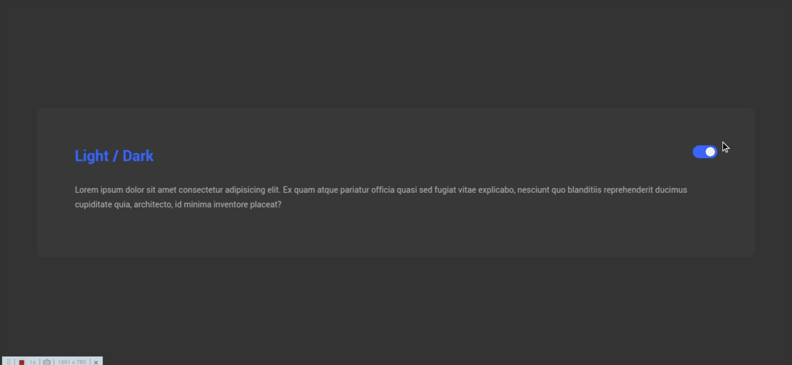

# dark-light-mode
Componente de alteração para Dark Mode de acordo com variaveis do CSS

<h1 align="center">
    Altere o seu layout para Dark Mode 🦇
</h1>

## 💻 Sobre o projeto

Porque todo site ou app mobile deveria ter Dark Mode:

## Redução da tensão ocular
Olhar para uma luz brilhante, intensa e permanente causa uma grande tensão nos olhos. O uso de uma luz mais escura proporciona ao descanso da vista, resolvendo assim este problema.

Luzes como por exemplo a azul poderá prejudicar os olhos porque é uma luz forte para a retina que é muito sensível a esse tipo de luzes e o risco da sua degeneração é mais possível nos casos de incidência da luz constantemente. Existem filtros de luz azul no dark mode que é visualmente mais confortável.

## Dormir melhor
Mesmo sabendo, teimamos em espreitar o nosso telemóvel antes de dormir, e isso não nos ajuda a adormecer porque a luz brilhante confunde as células dos neurónios que induzem ao sono e por sua vez ativam antes as que nos fazem ficar acordados.

Confunde o ciclo do sono por completo provocando alterações de comportamento ao longo do tempo. Uma luz ou um tema mais escuro é a resolução de parte deste problema porque descontrai a tensão ocular e por sua vez, todo o organismo, não afetando o sono.

## Reduz as dores de cabeça e enxaqueca
Pessoas mais sensíveis à luz poderão ficar em risco de desenvolver fotofobia, se já não sofrerem desse problema. A

fotofobia é uma condição médica que torna os olhos sensíveis à luz e o uso de dispositivos com luzes brilhantes, poderão piorar esse problema, assim como o aumento de enxaquecas. O dark mode é um aliado de quem sofre desta condição.

## Prevenção de problemas médicos graves
Poderão achar um exagero mas a falta de sono pode levar a vários distúrbios e doenças como a depressão, a obesidade que por sua vez levam a problemas cardiovasculares. Uma boa noite de sono é muito importante e necessária para o nosso organismo. e o uso do dark mode irá ajudá-lo a adormecer melhor do que uma luz brilhante e clara.

O que retiramos daqui, é que o dark mode ajuda a travar condições que a visualização constante de luzes brilhantes poderão provocar ao nosso bem estar e organismo dando origem a problemas mais graves.

---

## 🚀 Como executar o projeto

O projeto consiste em alterar os styles do HTML com um script básico que pode ser alterado de acordo com sua necessidade. No caso do exemplo que fiz, voce pode colocar quantas variáveis quiser na constante initialColors desde que, cada propriedade da constante, receba uma igual na constante darkMode.

A função changeColors recebe a key da constante e altera de acordo com a propriedade darkMode. Tudo que precisa fazer é alterar as variaveis CSS de acordo com seu projeto e acrescentar o Dark Mode no script.js para a alteração funcionar e trazer beneficios ao seu projeto!

    
 

---

## 💪 Como contribuir para o projeto

1. Faça um **fork** do projeto.
2. Crie uma nova branch com as suas alterações: `git checkout -b my-feature`
3. Salve as alterações e crie uma mensagem de commit contando o que você fez: `git commit -m "feature: My new feature"`
4. Envie as suas alterações: `git push origin my-feature`
> Caso tenha alguma dúvida confira este [guia de como contribuir no GitHub](./CONTRIBUTING.md)

---

## 🦸 Autor

 
  
 <b>Luiz Carlos Ribeiro</b><a href="https://blog.rocketseat.com.br/author/thiago/" title="Rocketseat">🖖</a>
  

  

---

## 📝 Licença

Este projeto esta sobe a licença [MIT](./LICENSE).

Feito com ❤️ por Luiz Carlos Ribeiro 👋🏽 [Entre em contato!](https://www.linkedin.com/in/luiz-carlos-dantas-ribeiro-junior-7422b9124/)

---
